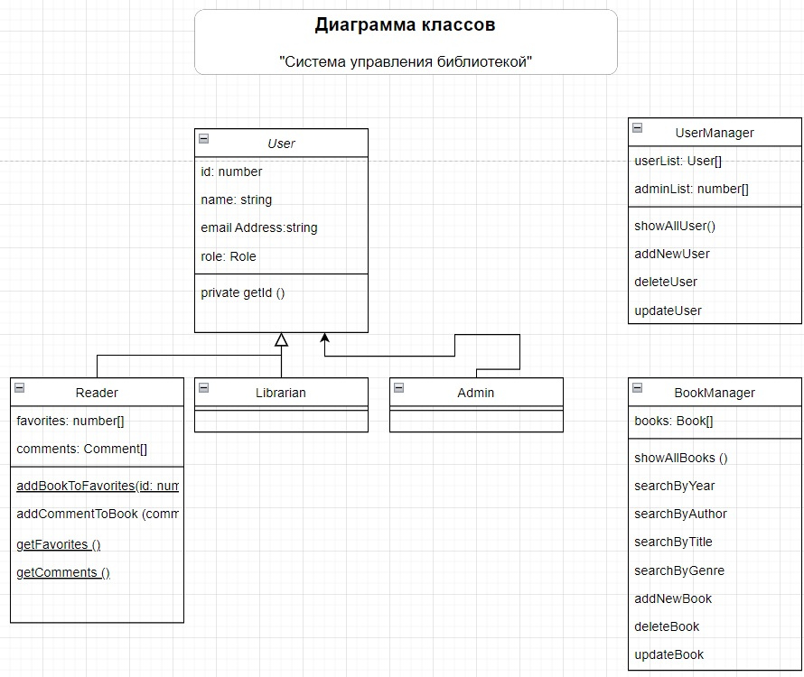

# Проект "Система управления библиотекой".

## Команды для запуска
- Cклонируйте репозиторий
```
$ git clone https://github.com/AnnAErmak/library-management-system-ts.git ./yourProjectName
```
- Скомпилируйте проект
```
$ npm run tsc
```
- Запустите
```
$ npm run start
```

### Функционал:
В момент запуска программы создаются следующие экземпляры классов:

1. **bookManager** - интерфейс для взаимодействия со списком книг
   - showAllBooks ()
   - searchByYear()
   - searchByAuthor()
   - searchByTitle ()
   - addNewBook()
   - deleteBook()
2. **userManager** - интерфейс для взаимодействия со списком пользователей
    - showAllUser()
    - addNewUser()
    - deleteUser()
    - updateUser ()
3. **ivan** - пользователь с правами "читатель"
4. **ira** - пользователь с правами "библиотекарь"
5. **oleg** - пользователь с правами "администратор"

### Диаграмма:

  